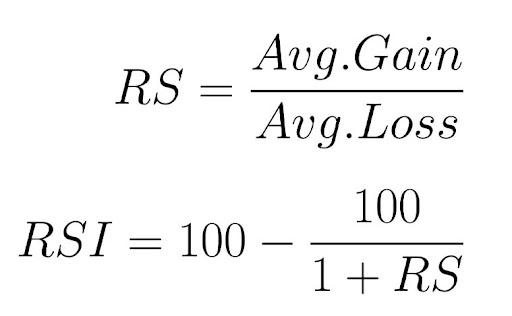

# How to Day Trade for a Living

## Rules

* **not to get rich quickly. TREAT IT SERIOUSLY**
* don't hold it overnight
* _Fear is more powerful than greed_
* greed with logics
* don't try to defeat institutional traders while serving as a retail trader
  * **stay away from it**
* **the more retail traders in my side (strategies), the better**
* differentiate the move: **the whole market? or it is an alpha predator**?
* trade **what** **retail traders are trading ---> liquidity**
* use **futures to predict and understand** future market
* **X penny stocks** ---> monitored by government
* **trading volume + volatility**&#x20;
* **risk control + admit "I'M WRONG"**
* play and lose the game gracefully. **NEVER FORGET YOUR LOGICS**.
* **minimize the risk and maximize the return**
  * bottomline:&#x20;
  * win: loss: 2 : 1
* **practice your brain's calculation ability**
* **multitasking with stress**
* **introspection**
* only trade alpha predators
* **QUALITY, TRADE WELL**
* find the balance of buyers and sellers and **bet on the winning** group
* **NEVER BRING YOUR MOOD IN TRADING**
* 5-minute chart
* **ENTER SLEEPY, LEAVE WILDLY**
* What goes up, must come down.
* Don't trade if it is **too extended**.
* **price stays flat for a few minutes** ---> may be on the flopping side of the flag, **stop out**
* get into the profits zone: **keep adjusting my stop point**
  * **break-even**
  * **low of the last 5 minutes candle**
* **develop my own method, stick to it**
* **don't mirror others ---> my own strategies and risk management**&#x20;
* **indicators are only indicators. they don't dictate**
* simulators: **practice / test new strategies**
* **observation**

* **minimize the setups and steps of strategies ---> psychological aspects**
* **plan a trade, trade a plan**
* **routine / discipline / health**
* **REFLECTION REGARDLESS OF SUCCESS OF FAILURE for REFERENCE**
  * **PLAY BOTH SIDES**
* k

## Routine

* sample

> 1. Morning routine&#x20;
> 2. Develop watch list&#x20;
> 3. Organize a trade plan&#x20;
> 4. Initiate the trade according to plan&#x20;
> 5. Execute the trade according to plan&#x20;
> 6. Journaling and reflection

## For Beginner Traders

* skills

> 1. analyze the balance of power between buyers and sellers, and bet on the winning group
> 2. money and trade management
> 3. sufficient self-discipline
> 4. swift
> 5. **simulators (amount of money in real world) + real-time data**
> 6. **keeping learning and discussing with other traders**
> 7. ****

## Logics

* buy long: buy the stocks and wait for the time to sell it
  * price increases
  * undervalued
* sell short: borrow stocks from brokers, sell it, and buy it back
  * price drops
  * overvalued

## Alpha predators: move with a **catalyst**

* types of catalyst

> * earning reports
> * earning warnings / pre-announcement
> * earning surprises
> * FDA approval / disapproval
> * merger / acquisition
> * alliances / partnerships / major product releases
> * major contract wins / losses
> * restructuring / layoffs / management changes
> * **stock splits / buybacks / debt offerings**

* high relative volume of stocks? ---> comparable to its **average performance**
* it is **independent of the overall market's performance**. ---> they move only due to the **catalyst**
* float: the number of stocks available for trading
  * low float (**price < $10**):
    * **micro cap : low float, but very volatile**
    * careful
    * **bull flag momentum** strategy
  * medium float **($10< price < $100)**:
    * **VWAP** and **Support or Resistance** Strategies
  * high float:
    * mega cape: no volatility
    * avoid unless catalyst
    * **moving average, reversals** strategy

## Scanner

* how to find alpha predators (before market):
  * 1, 2 implies 5
  * 3: ensures enough liquidity&#x20;
  * 4: ensures enough volatility

> 1. in pre-market, the price gaps up or down at least $1
> 2. at least 50,000 shares in pre-market
> 3. average daily volume of over 1 million shares
> 4. average true range of over 50 cents (the range of stocks' prices on average every day)
> 5. catalyst

* how to find alpha predators (real-time market):
  * 1,3,5: alpha
  * 2: volatility
  * 4: liquidity&#x20;

> 1. price gaps up or down at least $1
> 2. ATR: over 50 cents
> 3. **average relative volume(volume / average volume)** of at least 1.5&#x20;
> 4. average daily trading volume of at least 0.5 million
> 5. if they are in the same sectors ---> may not be alpha

* how to find real time bull flag momentum:
  * find low-float stocks that are moving
* how to find real time reversal:
  * selling off or surging up

## Candlesticks

* a chart that requires
  * highest / lowest price in that period
  * opening price and closing price in that period
* hollow candlestick: closing price > opening price
  * **buying pressure** ---> more people buy, price goes up
  * **big hollow body**: **bullish candles** ---> body represents the difference between opening and closing prices
  * 
* filled candlestick: closing price < opening price
  * **selling pressure** ---> more people sell, price goes down
  * **big filled body**: **bearish candles** ---> body represents the difference between opening and closing prices
  * 
* bid-ask spread:
  * ask: the lowest price of sellers
  * bid: the highest price of buyers

## Spinning Top

* wicks longer than the body of the candle
* **ONLY INDICATE indecision - equal power of buyers and sellers**
* dojis ---> the longer tail implies the loser, and **the smaller tail represents the trend of reversal**.
*

## Day-Trading Strategy

* **don't care about the company and their earnings**
* trade management:
  * separate by **target points**
* support: the floor of price
* resistance: the ceiling of the price

### ABCD Strategy

* A: buyers buy the stocks aggressively
* B: buyers begin to sell
  * **looking at the candle ---> selling power**&#x20;
  * **not enter, we don't know the bottom**
* C: find a potential support
  * **looking at the candle ---> buying power**
  * **buy the price between B and C after C point**&#x20;
  * **after buying the stock, if the price goes lower than it, we stop**
* D: where we sell the stock
  * **sell half of the positions**
* second exit point: **hit my target / trend is losing power**

### Bull-Flag Momentum

* **low float stock**

* consolidation: the buyers are selling the stocks for profits
  * buyers and still entering, and sellers are not in control yet
* enters **only the** **first and second consolidation**
* NOTES: consolidation is an **AREA**

* stop-loss: **low of consolidation area**
* when **price moves over the high of the consolidation flag, buy it**
* **fast ---> compact version of ABCD**
* **long-based**

### Top and Bottom Reversal Trading

* **defined entry point**&#x20;
* sell off quickly:
  * hedge fund&#x20;
  * retails trader short selling the trade
    * **entry point ---> short sellers will buy back**.

* **at least 5 (5-10) same moving direction candlesticks**
* the stock is **trading close to or the outside of the Bollinger band**
  * Bollinger line:
    * center line: simple **moving average** of closing price
    * two bands: **standard deviation**
* the stock has an **extreme RSI indicator**.
  * **> 90 (overbought) or < 10 (oversold)**
  * RSI (Relative Strength Index):
    * average gain: the amount of price going up / 14&#x20;
    * average loss: the amount of price going down / 14
    * **both positive**

* when the trend is going to an end, normally **a spinning top or doji forms**&#x20;
* **confirmation of price change:**
  * **doji / spinning top**
  * **the first 1 minute / 5 minutes candlesticks reach new high (meaning out of the current price change)**
* a long tun of making new lows ---> **the first one making new high** is the entry point
  * **5 minutes: a better confirmation**
* stop point: **low of the day or 20-30 cents down**

* only **trade extremes**

### Moving Average Trend Trading

* **no fundamental reason for it being a support**
  * **only a lot of people use it**
* EMA: exponential moving average
  * weighted moving average in a period
  * **places greater emphasis on recent dates than past**
* we need a **trend with moving average**
* **we long the stock on the top of moving average while shorting the stock as the price breaks the moving average BASED ON SITUATION**
  * break point:
    * e.g. **5 cents** below the EMA
    * **half position sometimes** ---> do not always wait until the break point

* problems:
  * may take a long time
  * don't know which **EMA / SMA with different intervals** is accurate&#x20;
* recommend:
  * **9, 20 EMA + 50, 200 SMA**
  * 11, 21 EMA + 50, 200 SMA

### VWAP Trading (Volume Weighted Average Price)

* VWAP: **cumulative dollars (volume \* price)  traded for every transaction / total shares traded**

* what does the "**cumulative**" mean:

* **long when the price is lower than VWAP and short when the price is higher than VWAP**.

* **short the stocks when the stock price tries to break VWAP (as resistance) but not**

* stop: the price point that the orders are executed&#x20;
  * buy stop / sell stop
* long procedures:

> 1. When I make my watch list for the day, I monitor the price action around VWAP. If a stock shows respect toward VWAP, then I wait until a confirmation of the VWAP break or support.&#x20;
> 2. I usually buy as close as possible to minimize my risk. My stop will be a break and close 5-minute chart below VWAP.
> 3. I keep the trade until I hit my profit target or until I reach a new support or resistance level.&#x20;
> 4. I usually sell half-positions near the profit target or support or resistance level and move my stop up to my entry point or break-even.

### Support and Resistance Trading

* diagonal trend lines: subjective
  * the market **only** **remembers price level**
* support:
  * horizontal line connecting two or more bottoms
* resistance:
  * horizontal line connecting two or more tops
* on **stocks with a fundamental catalyst**
* before the market opens, find the **previous recent support or resistance**
* **draw it only think it exist**

* hints for finding it:
  * **indecision candles around**
  * **half dollar or whole dollar (if don't find it clearly, it may exist as a hidden resistance or support line)**
  * **the more number a line touches a price line, the better**
  * **only the support and resistance in the current line range**
  * **an area (5-10 cents)**
  * **the stock must have a clear bounce in this level**
  * **extreme prices**

> 1. Each morning, when I make my watch list for the day, I quickly look at the daily charts for my watch list and find the area of support or resistance.&#x20;
> 2. I monitor the price action around those areas on a 5-minute chart. If an **"indecision candle"** forms around that area, that is the confirmation of the level and I enter the trade.&#x20;
> 3. I usually buy as close as possible to minimize my risk.&#x20;
> 4. Stop would be a break and a close 5-minute chart under support or resistance level. I will take profit near the **next support or resistance level**. I keep the trade open until I hit my profit target or I reach a new support or resistance level.
> 5. I usually **sell half-positions near the profit target or support or resistance level** and move my stop up to **my entry point for break-even**.&#x20;
> 6. If there are **no next obvious support or resistance levels**, I will consider closing my trade at or **near half-dollar or round-dollar levels**.

## Manage Risks:

> 1. right stocks?
> 2. share size?
> 3. stop loss? ---> bottomline: 2% of total account equity

* steps for risk management:

> 1. the maximum dollar risk size
> 2. estimate the maximum dollar risk per share, the strategy top loss from my entry
> 3. divide 1 by 2 to find the maximum number of stocks

